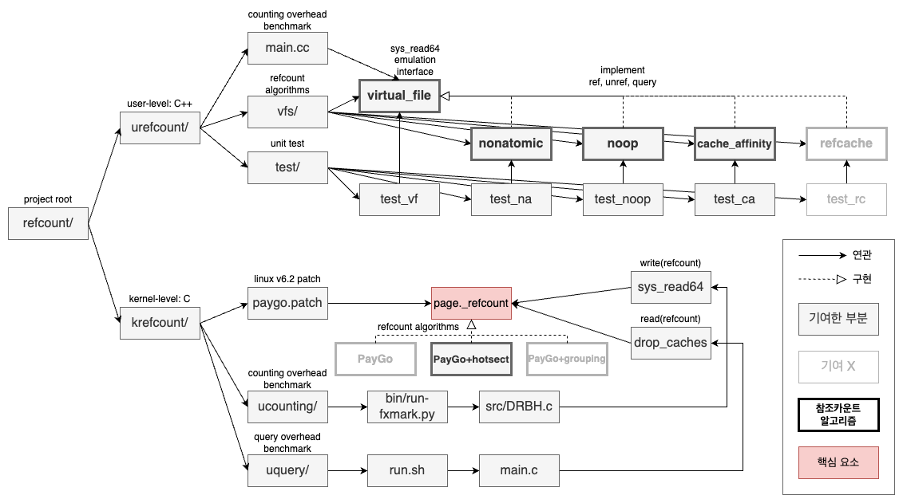

# Scalable Reference Count
This is a graduation project with [DBOS Lab, HYU](http://dbos.hanyang.ac.kr/).

## Abstract
The current Linux file system does not have good performance scalability in a multi-core environment, and performance deteriorates as the number of cores increases. One of the causes of this problem is the reference count. And there are many algorithms to solve it. Our goal is to improve the multi-core preformance scalability of the Linux file system with them.

## 1) Background
### 1.1 In-memory File System
The operating system uses a faster device, memory, to compensate for the slow IO speed of the disk. In the case of the Linux file system, one block on the disk is mapped to one page of memory. In addition, Linux utilizes the Virtual File System (VFS), which virtualizes the file system, to manage files in memory rather than on disk. In other words, Linux was able to increase performance by working on the file system in memory rather than on disk.

### 1.2 Reference Counting in Linux Kernel
A reference count is used to decide whether a object is no longer needed or not. If the reference count becomes 0, then the object can be reclaimed. This is because the object is no longer referenced by anyone. On the other hand, if the count is more than 0, the object must not be reclaimed.

Linux kernel uses the reference counting to manage physical pages [1]. A `struct page` is mapped to a physical page. And the `_refcount` field of the data structure represents how many tasks references the physical page. Yes. This is the reference count of a page. If it is more than 0, then it must not be reclaimed. With in-memory file system, blocks of a file are mapped to pages in memory. And each page has its own reference count field. If a reference count for a page of a file is more than 0, the page must remain.

### 1.3 Limitation of Linux File System
The in-memory file system of Linux maintains pages for files with the reference counting. Before accessing a page, the reference count of the page increases by 1. Then, after finishing a job, the reference count decreases by 1. The reference count prevents for a page to be reclaimed during a job.

However, this in-memory file system has performance limitations in a multi-core environment [2]. When the single shared resource is accessed by multiple cores, the resource has to be synchronized in cache-lines. Modern CPUs support the synchronization with MESI protocol. But it causes performance degradation in times. In particular, this limitation becomes more apparent in the Non-Uniformed Memory Access (NUMA) architecture, which uses multiple multi-core CPUs in multiple sockets.

## 2) Project

1. Implement various refcount alogrithms in user-level
2. Implement PAYGO in kernel-level (linux-v6.2.0)

## 3) References
[1] [Kernel source linux/include/linux/mm_types.h](https://elixir.bootlin.com/linux/v6.2/source/include/linux/mm_types.h#L35)

[2] [Understanding Manycore Scalability of File Systems](https://taesoo.kim/pubs/2016/min:fxmark.pdf)
