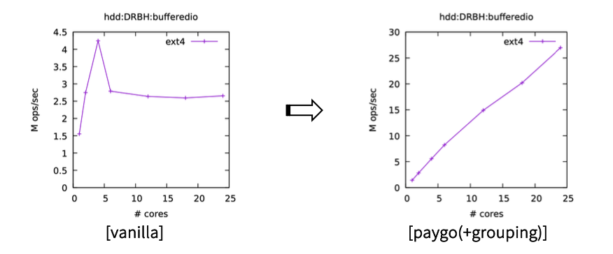
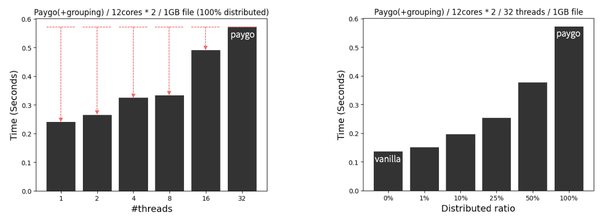

# Kernel reference count


## 1) Kernel
### Install packages
```sh
sudo apt install -y build-essential libncurses5-dev libssl-dev bc bison flex libelf-dev qemu-kvm qemu virt-manager virt-viewer libvirt-bin libguestfs-tools
```
### Download kernel source
```sh
git clone --depth 1 --branch v6.2 git://git.kernel.org/pub/scm/linux/kernel/git/torvalds/linux.git
cd linux
```
### Apply patch
```sh
patch -p1 < ../paygo.patch
```
### Set config
```sh
mkdir build
make O=./build defconfig
make O=./build menuconfig
```
- Processor type and features > Support x2apic (O)
- Processor type and features > Randomize the address of the kernel image (X)
- Kernel hacking > Generic Kernel Debugging Instruments > KGDB: kernel debugger (O)
- Kernel hacking > Compile-time checks and compiler options > Debug information (Disable debug information) > Rely on the toolchain's implicit default DWARF version (O)
- Kernel hacking > Compile-time checks and compiler options > Debug information (Disable debug information) > Provide GDB scripts for kernel debugging (O)
- Kernel hacking > x86 Debugging > Choose kernel unwinder > Frame pointer unwinder (O)

### Build kernel
```sh
make O=./build -j
```

## 2) Guest OS on qemu
### Prepare a disk for guest OS
```sh
cd ..
mkdir disks
wget -O disks/VM.img https://cloud-images.ubuntu.com/bionic/current/bionic-server-cloudimg-amd64.img
sudo virt-customize -a disks/VM.img --root-password password:123456
```
### Prepare a disk for experiment
```sh
dd if=/dev/zero of=disks/empty.img bs=1M count=10240
```
### Run guest OS by our kernel
```sh
vi run.sh
```
Before running qemu, adjust the virtual machine options to suit your current system.
```sh
sh ./run.sh
```
```sh
(in guest)
ubuntu login: root
Password: 123456
```

### (optional) Activate network
```sh
(in guest)
$ dhclient -v
```

## 3) Evaluation
### Our environment
```
- 24 cores (12 cores/CPU, 2 sockets)
    (Intel(R) Xeon(R) CPU E5-2699 v3 @ 2.30GHz)
- 48GB DRAM
- Ubuntu 18.04.6 LTS (ubuntu 6.2.0-dirty)
```
### Counting overhead
#### How to eval
```sh
(in guest)
$ git clone https://github.com/HM4725/refcount.git
$ cd refcount/krefcount/ucounting
$ git submodule init
$ git submodule update
$ make
$ bin/run-fxmark.py
```
Refer to [ucounting](./ucounting/README.md) or [fxmark](https://github.com/sslab-gatech/fxmark) for more details.
#### Result


### Query overhead
#### How to eval
```sh
(in guest)
$ cd ../uquery
$ make
$ ./fadvise
```
Refer to [uquery](./uquery/README.md) for more details.
#### Result

